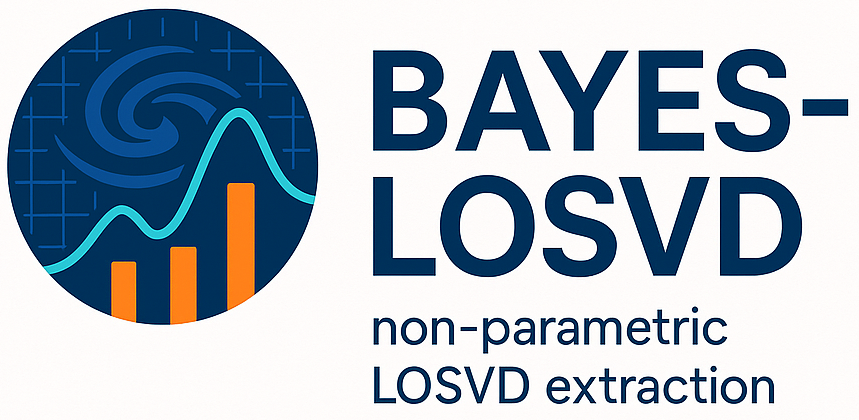

BAYES-LOSVD is a python framework for the non-parametric extraction of the Line-Of-Sight Velocity Distributions in galaxies. It makes use of Numpyro/JAX to perform the Bayesian inference and thus provide reliable uncertainties for all the parametes of the model chosen for the fit. The code comes with a large number of features, including read-in routines for some of the most popular IFU spectrographs and surveys: ATLAS3D, CALIFA, MaNGA, MUSE-WFM, SAMI, SAURON. 

### Authors

- Jesús Falcón-Barroso (Instituto de Astrofísica de Canarias, Spain)
- Marie Martig (John Moores University, UK)

### Installation and documentation

Clone this repository in your computer and open the following file in your browser:

BAYES-LOSVD/docs/build/html/index.html

### New in this release

- This is a major release introducing a new inference backend.
- The code now uses NumPyro/JAX (see bayes-losvd_packages_XXX.yaml for the required packages).
- This implementation enables seamless CPU and GPU computations for improved performance.

### Acknowledgments

If you have found this software useful please consider including the following citation in your work:

*BAYES-LOSVD: a bayesian framework for non-parametric extraction of the LOSVD*

J. Falcón-Barroso & M. Martig

Astronomy & Astrophysics, 2021, 646, A31
(https://ui.adsabs.harvard.edu/abs/2021A%26A...646A..31F/abstract)

......

