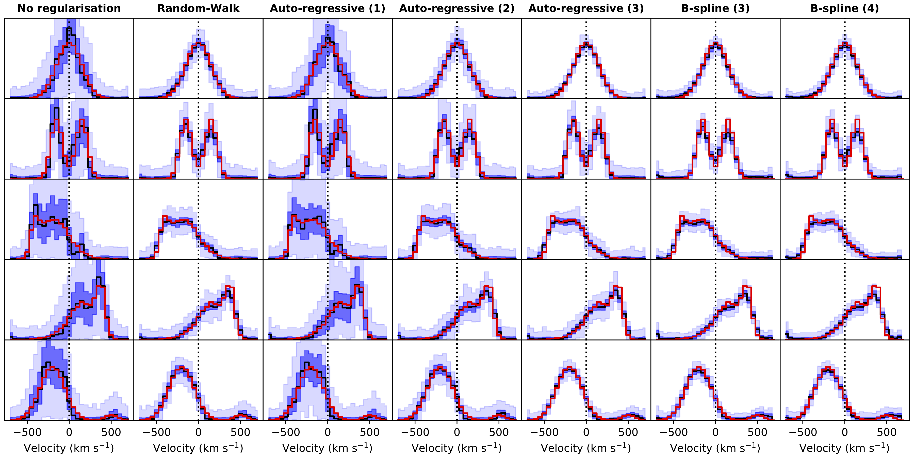

Overview
========

BAYES-LOSVD is a python framework for the non-parametric extraction of the Line-Of-Sight Velocity Distributions in galaxies. It makes use of Stan (https://mc-stan.org/) to perform all the computations and provide reliable uncertainties for all the parametes of the model chosen for the fit. The code comes with a large number of features, including read-in routines for some of the most popular IFU spectrographs and surveys: ATLAS3D, CALIFA, MaNGA, MUSE-WFM, SAMI, SAURON. 

Example figures
"""""""""""""""""""""""
.. figure:: example_figure1.png
   :width: 300
  
   LOSVD recovery for no regularisation and an auto-regressive (order 2) prior. Black line on main panels are the input test data with S/N of 100, while the red line shows the best fitting model. Residuals are indicated in green. The spectral fits are carried out with 5 PCA templates. In the insets, the input LOSVD is a Gaussian centred at zero and a velocity dispersion of 150 km/s (indicated in red). The recovered median values of the LOSVDs are indicated with a thick black line. 16%-84% and 1%-99% confidence limits at each point are indicated in dark and light blue, respectively. 

   LOSVD recovery for different input LOSVDs and types of regularisation. Colors as figure above. Each row represents a particular LOSVD shape for different types of regularisation. These are solutions for input spectra with S/N=50. All panels are plotted on the same scale.